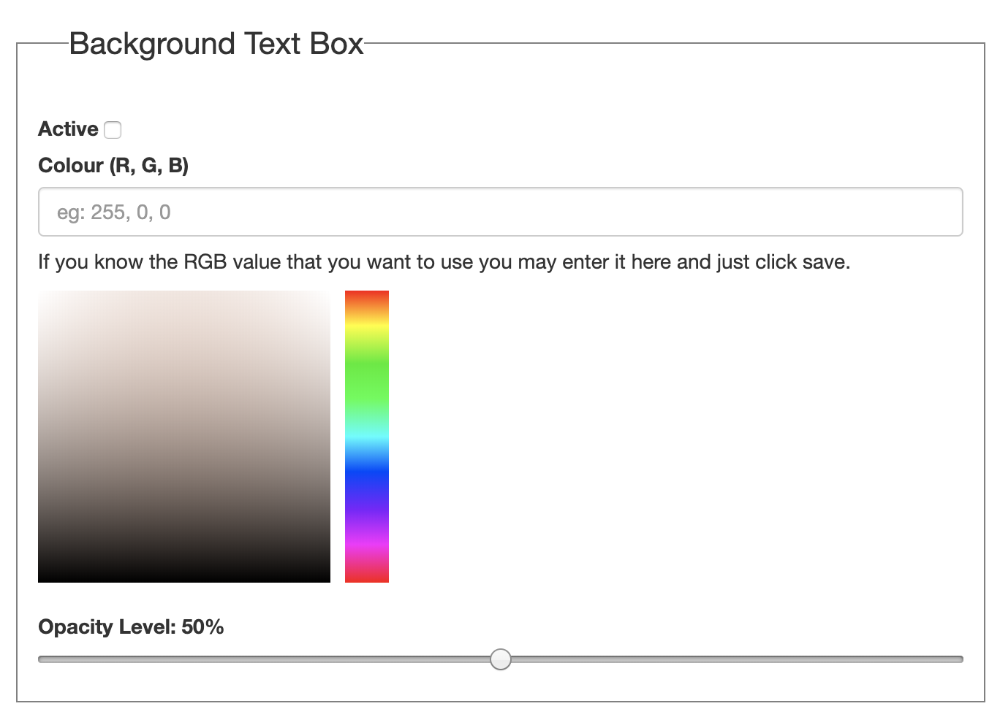

The Background Video item has video that is intended to play behind headline, subtitle, and/or body text. Background videos do not have player controls, and by default will continuously loop their playback.

## Fullpage

This checkbox determines whether the final Mural story output will be more focused upon the video or the text. If the element is checked then your text will be forced towards the bottom of the Mural story window to allow more space for the video.

## Title

This is where you write your title for the item, such as a headline.

## Subtitle

If required you can have a subtitle for the item, such as a subheading.

## Text

This is the main text of the Mural story output of this editor pane. It is in rich text and can be formatted to include links, bold, italicised, and other text modifications.

## Video sources

Both video formats have a preview window available. At least one format is required - these days all modern browsers play mp4 so webm is not strictly necessary.

### MP4

This is where you input your MP4 video file

### Webm

This is where you input your Webm video file

## Offset portrait video

This lets you offset the video so that when a user holds their mobile phone vertically, the most important part of the video is shown to them. In all cases, the video will be stretched to fit the height of the mobile phone screen. There are four options to offset the video:

### Left

Aligns the upper left corner of the video with the upper left corner of the mobile phone viewport. This is the default when the feature is not activated.

### Center

Aligns the center of the video to the upper left corner of the viewport, as is shown.

### Right

Aligns the top right corner of the video with the top right corner of the viewport, as is shown.

### Custom offset

lets you set an arbitrary value for your offset. This may take some trial and error to get the right offset, but it will give you greater control over what is shown.

## Background Text Box

You can set the colour and opacity of the text background box. This is especially helpful for improving text readability for videos where the colour includes both light and dark areas. By picking a background colour and opacity level, you can have a more consistent background for your text. The text box colour and opacity can be set when the `Active` checkbox is ticked.

### Background Colour

You can set a background colour either by typing in the RGB color value in the form of three numbers between 0 and 255 separated by commas, or by clicking on a color using the color picker.

### Opacity

You can set the level of opacity by moving the opacity slider. 0% opacity means the text background box is completely transparent and the background video is displayed at full intensity, while 100% opacity means that the text background box has a completely solid color.

## Poster Image

This is a still image that loads before the video and serves as an alternate.
