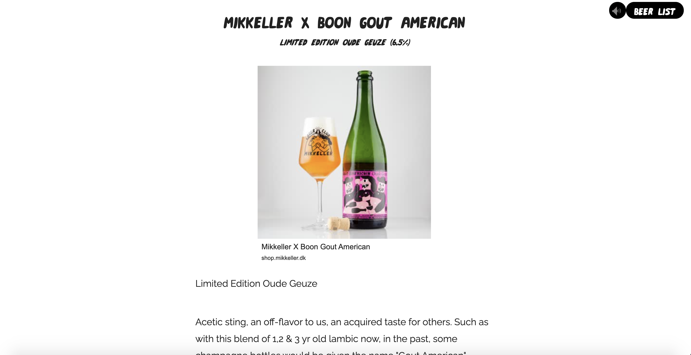
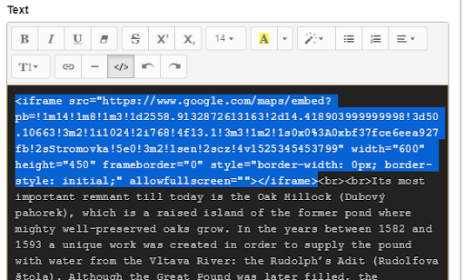

A Centred text item handles a large amount of text, laid out in the center of the screen, and can have images on left, right, or middle of the text column. This is good for the parts of your story which have long texts.

## Light

This makes the text dark on a light background when checked, or light on a dark background when it is not checked.

## Title

This is where you write your title for the item, such as a headline.

## Subtitle

This is where you write the subtitle for the item

## Intro

This is where you write the introduction text for your item.

## Content Blocks

`Image [+]` - Clicking this adds an image to your text.

### Align

left, center or right - this places the image either left, center or right in the text column.

### Src

Input the image here

### Credits

This is where the photo's credit is written.

### Text

This is where your body text goes, until you decide to add another content block for images and text.

### Embedded content

You can embed other content into the text area. To do so, click the Code View `</>` button in the browser to see the HTML code, as is seen below:

Paste your embed code where you want it to be placed in the text. When you click the Code View `</>` button again, the text window will be back in WYSIWYG mode, and you should be able to see your embed. **CAUTION** you must switch back to WYSIWYG view after a code edit to make the changes take effect.

### Instagram embeds

If you wish to support iPhone 5 screen portrait dimensions without introducing a horizontal scrollbar then Instagram embeds need to have their `min-size` CSS value reduced from `326px` to `290px`. This simple change has no effect on any other display properties on any other platform and will allow you to continue supporting your audience’s older phones for longer. We’ve tested other embeds such as YouTube, Vimeo, Google Maps and Soundcloud, and all work fine on smaller phone displays; it seems to be an Instagram-specific issue.
