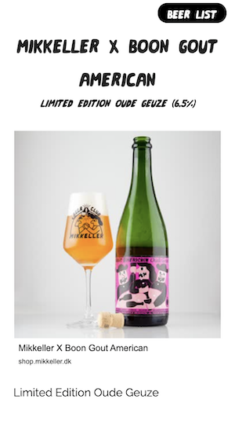

A Centred text item handles a large amount of text, laid out in the center of the screen, and can have images on left, right, or middle of the text column. This is good for the parts of your story which have long texts.

## Title

This is where you write your title for the item, such as a headline.

## Subtitle

This is where you write the subtitle for the item

## Introduction

This is where you write the main text for your item.

## Add image

To add an image, click the Image button in the text editor field. You can either upload an image or add a URL.

### Alt text

This is where you write the alt text for your image.

### Resizing image

There are two fields that allow you to resize your image, vertically and horizontally. This is set to the full width of the text area by default.

### Align

left, center or right - this places the image either left, center or right in the text column. You adjust the alignment by first clicking on the image, then a popup menu appears with 'L' (for left), 'C' (for center) and 'R' for right.

## Black text on white background

This makes the text black on a white background when checked, or white on a black background when it is not checked.

### Navigation

This is where you put the text you want to appear in the Navigation hamburger menu in the story.
