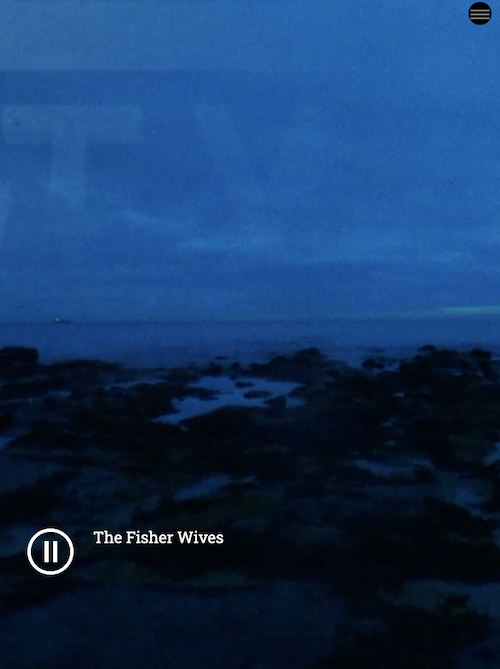

The Fullpage video item refers to a section of your Mural story where there is a video that takes up the entire screen with a play/pause button. There is less room for text in the Fullpage video item, usually a line or two, if any.

## Choose video

This is where you select the video you want to include. You can use video files either from your computer's file system or from a URL. Video files have to be in the MP4 format, but you can use iOS .mov files if you rename the file extension to .mp4. A preview thumbnail of the video will appear.

## Loop video

When checked, the loop video option allows you to repeat the video when it finishes.

## Auto advance

When checked, the auto advance will move the video item out of the viewport and bring in the next item automatically.

## Title

This is where you write your title for the item, such as a headline.

## Text

This is where you write the body text for the page.

## Poster Image

This is a still image that loads before the video and serves as an alternate.

## Navigation

This gives the item a name that can be used in the Navigation hamburger menu in the exported story.

## Offset portrait video

This lets you shift the video to the left or right when it is viewed in mobile devices that are vertically-aligned. You can shift to the left, right or center, or to a setting that you define yourself.
