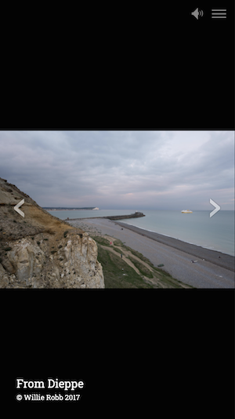

A Horizontal slideshow item refers to a collection of images that can be displayed in a slideshow with controls on the left and right, and where the images advance horizontally when a user clicks on the control.

`Add item` Clicking this button adds another slide to the slideshow. You can have as many slides in the slideshow as you want. For optimal results long slideshows are discouraged as currently all images for a slideshow are bulk loaded as a set.

## Slideshow Title

This is for the title of the entire slideshow.

## Navigation

This is where you write the text you want to appear in the story's navigation menu.

## Items

### Upload image

This is where you select the image to be uploaded. Images can be in common formats such as .gif and .jpg. Images for the slideshows must be uploaded from your computer's file system - you cannot use image URLs in the horizontal slideshow.

### Slide title

This is where you write the text for the individual slide. 

### Slide credits

This is where you write the text for the image credit, should you choose to use it.

### Image alt text

This is where you write the alt text for the individual slide.

The width in pixels of each breakpoint of a Mural story window are:

- 768px
- 992px
- 1200px
