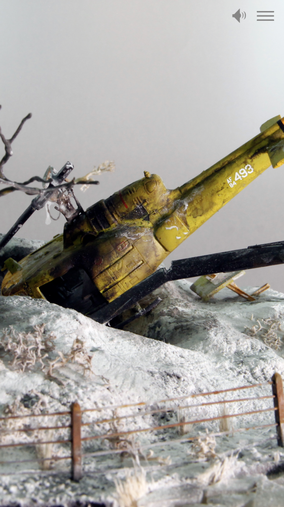
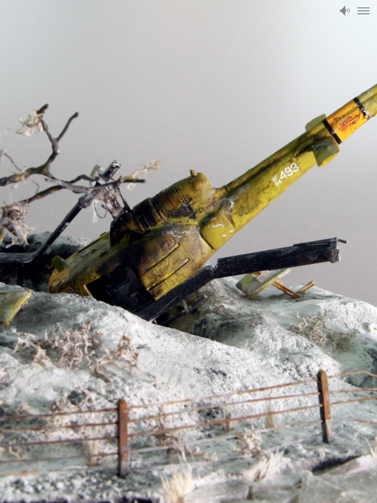

An Image Audio item is a still image that can play audio in the background. This is useful for ambient, environmental sound, or for sound material with images attached. An audio file attached to an Image Audio item will play until the user scrolls away to advance to the next item. Audio files can be looped for continuous play until the user scrolls away.

## File Sources

### Upload image

This is where you upload the image in common formats such as .jpg, .png or .gif. You cannot use an image URL with this item.

### Choose audio

This is where you upload the audio file. The audio file must be in .mp3 format and must be uploaded from your computer's file system. You cannot use a URL for your audio file.

### Loop audio

Click this check box to enable your audio file to be looped when the item is viewed.

### Black text on white background

Click this text box to enable black text on a white background. By default the image audio item uses white text on a black background.

## Title

Type text into this window for your image's title. 

## Image caption

Type text into this window for your image's caption text. The image caption text is intended to be relatively short. If you have longer text, consider using a background text item instead.

## Navigation

The text you type into this window will appear in the story's navigation menu.

## Image credits

Type text here to credit the image's creator.

## Audio credits

Type text here to credit the creator of the audio.
