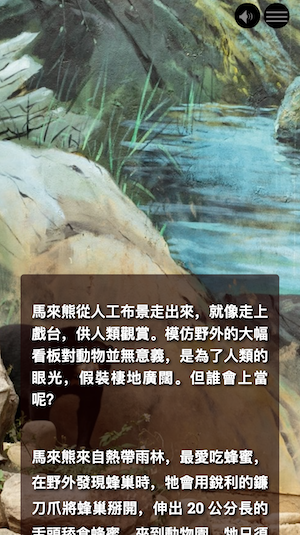

An Image Background item has a still image that takes up the entire screen, but which has title, subtitle, and body text over it as well as the possibility for looping audio. An Image Background item's image remains unmoving when a user scrolls until all of the text has scrolled. Then the story advances to the next item.

## Upload image

Clicking this button allows you to select the image you want to use from your computer's file system. Images can be in common formats such as .jpg, .png, or .gif. The image will be enlarged to fit the width of the window. You cannot use a URL for your image file.

## Full page layout

This checkbox determines whether the final Mural story output will be more focused upon the image or the text. If the element is checked, then your text will be forced towards the bottom of the Mural story window to allow more space for the image.

## Title

This is what you would like the title of the Mural story output of this editor pane to display.

## Subtitle

This is the subtitle that displays under the main Mural story output of this editor pane.

## Position body text

Depending on the composition of your image, you may want to position your text on the left, center or right of the screen. Checking one of these buttons will align the text items accordingly. By default, the body text is aligned to the left.

## Text

This is the main text of the Mural story output of this editor pane. It is in rich text and can be formatted to include links, bold, italicised, and other text modifications.

## Navigation

This is what the name of this view output will be called in the Mural story navigation menu. This does not have to be the same as the title.
Navigation is not a mandatory field and it can be left blank (not recommended) but it can also be supressed from the navigation (recommended if the field is blank).

## Image alt text

Type the alt text you want for your image here.

## Choose audio

This button enables you to upload an audio file to play in the background of your image. The audio will play until the user navigates away from the item. Files must be uploaded from your computer's file system - you cannot use a URL for your audio file.

### Loop

Checking this box sets the audio to play on a loop. The audio will play until the user navigates away from the item.
