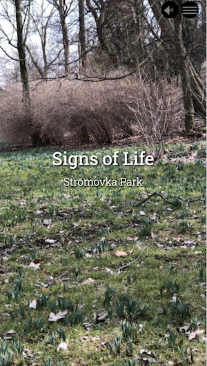
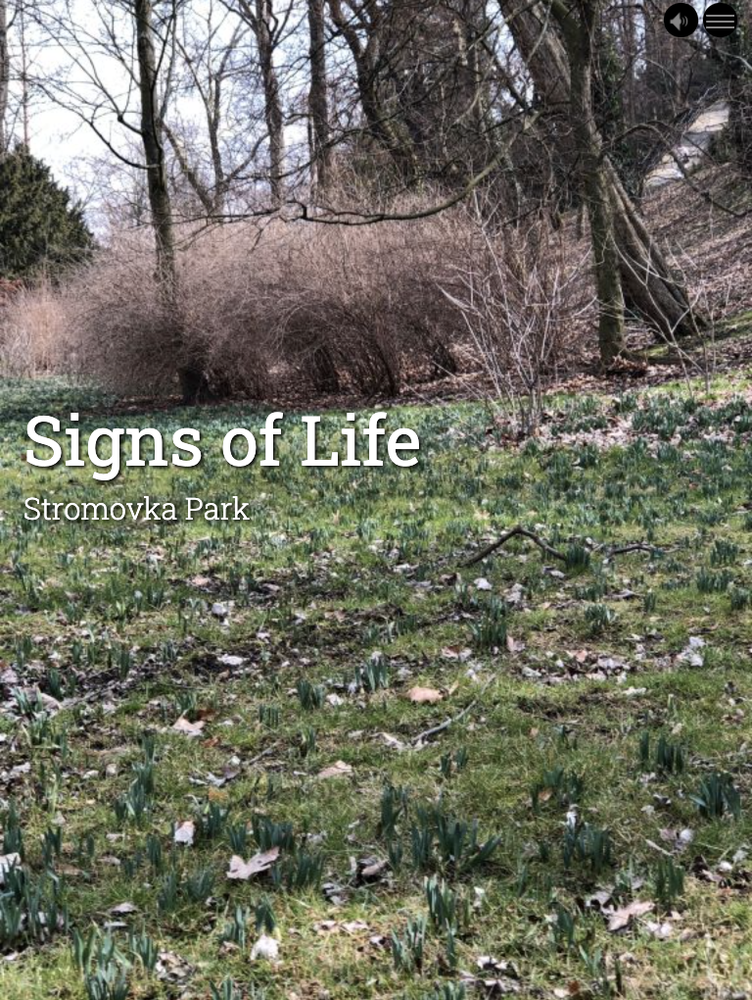

A Parallax image with text item has a still image with text that has a parallax scrolling effect, meaning that the text seems to move at a different speed than the image behind it. Select your image and input the text you want to display with it. The Parallax Image item is not intended for large amounts of text; for longer texts, consider using the Image Background item instead.

## Upload Image

Clicking this button brings up the menu where you select the image file you want to use in the item. Images can be in common formats such as .jpg, .gif or .png. You cannot use a URL for your image.

## Title

This is where you write your title for the item, such as a headline.

## Subtitle

This is where you write the subheading for any headline.

## Image Alt Text

This is where you type the alt text for your image.

## Navigation Title

Text you type into this window will appear in the story's navigation menu.
