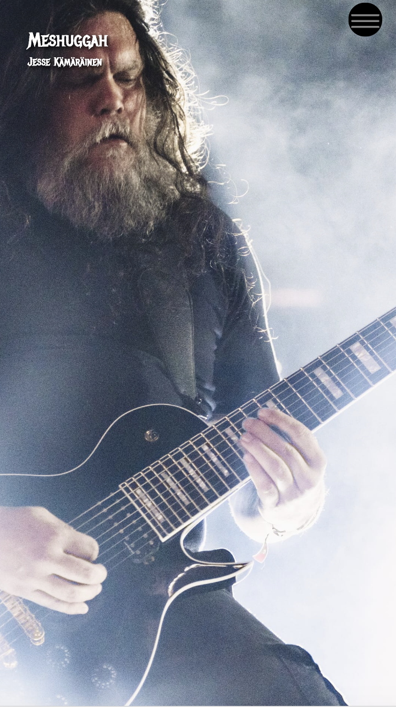
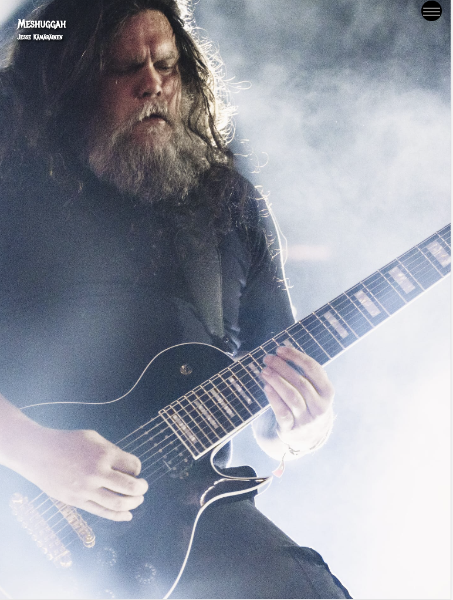

A Vertical slideshow item refers to a collection of images with captions that can be scrolled through in a set - each slide "sticking" to the top of the screen until the following slide replaces it.

`Add item` Clicking this adds another item to the slideshow. You can have as many items in the slideshow as you want. For optimal results large slideshows are discouraged as currently all images for a slideshow are bulk loaded as a set.

## Title

This is for the title of the slideshow.

## Navigation

This is for the text that will appear in the story's navigation menu.

## Black text on white background

This check box switches the color scheme. By default the slideshow uses white text on a black background.

## Add item

### Upload image

This is for uploading your image to the slideshow. Images can be in common formats such as .jpg and .gif. Images must be uploaded from your computer's file system - you cannot use image URLs in the slideshow.

### Slide title

This is where you can write the text that will be displayed with the individual image.

### Slide credits

This is where you can write the text for the individual image credit.

### Image alt text

This is where you write the image's alt text.
