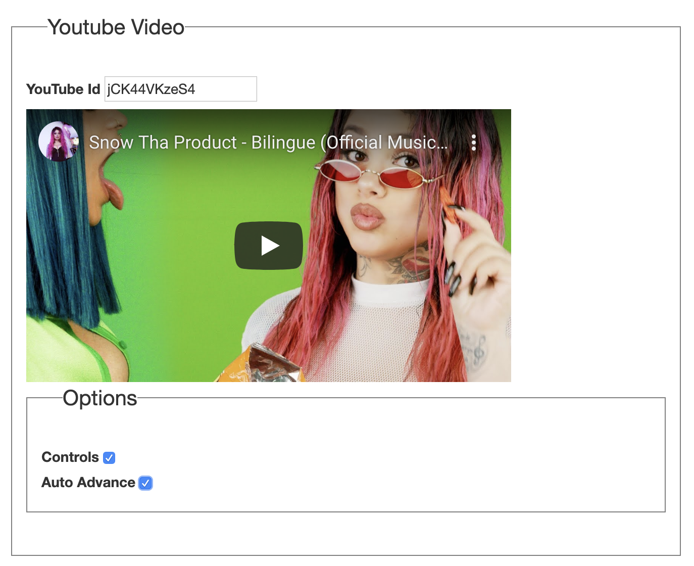

A YouTube item sets a YouTube video to play in a full frame in a Mural story. Playback is triggered automatically by scrolling down into the item, or by the user clicking on the YouTube “play” button in the center of the video.

## YouTube ID

The code YouTube uses for a video. If a video has a URL of https://www.youtube.com/watch?v=jCK44VKzeS4, you would disregard everything before the equals sign, and input `jCK44VKzeS4`

## Options

### Controls

When this switch is selected, YouTube’s controls (for things like play/pause, share and timeline) are visible. When the switch is off, only the minimum controls required by YouTube are displayed.

### Auto-advance

When this switch is selected, the item will automatically scroll to the next item when the video playback is finished.
**NOTE**: Certain YouTube videos - especially music videos managed by Vevo - are not allowed to be used outside the YouTube site. This is specified by the video’s copyright holder and is outside our control. In such an event YouTube will display an error and you will have to use another piece of content for your story.
