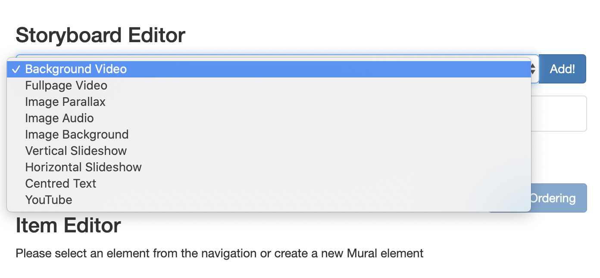
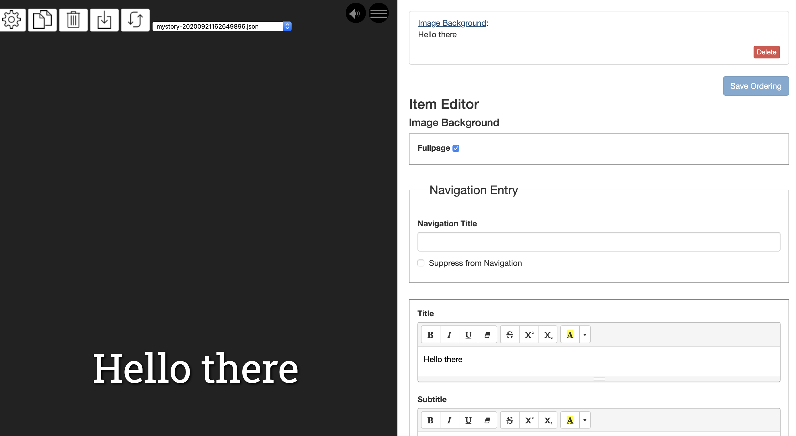

Mural is shipped with one sample story _Searching for Spring in Stromovka_ created by us here at Mural.

You can get a feel for using the editor by clicking into each item on the storyboard and viewing how the information on the form has been filled out for a particular item.

When you're ready to move on to create your own story you can start by hitting the copy icon in the top left toolbar and entering the name of your story.

Delete all the items on the storyboard to clear the example content away and start from scratch. You can't remove the meta information area, but please update this section by clicking on the area to open its accompanying form on the storyboard to edit the information.

At the top of the storyboard editor pane you can use the dropdown to choose which type of Mural item you want to add next to your new story. The current choices of items include

- Background Video
- Fullpage Video
- Image Parallax
- Image Audio
- Image Background
- Vertical Slideshow
- Horizontal Slideshow
- Centred Text
- Youtube

I've chosen an Image Background item here to start with. You can click on the text "Image Background" to open the form to edit this item at the bottom of the storyboard. When you click the save button at the bottom of the storyboard the item preview on the left will update and you will be able to see your changes! Click the play button to start the story and view your work to this point. Well done! You've created your first story in Mural!

