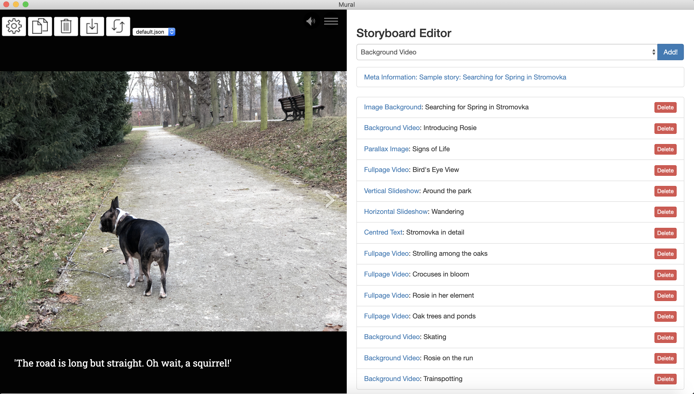
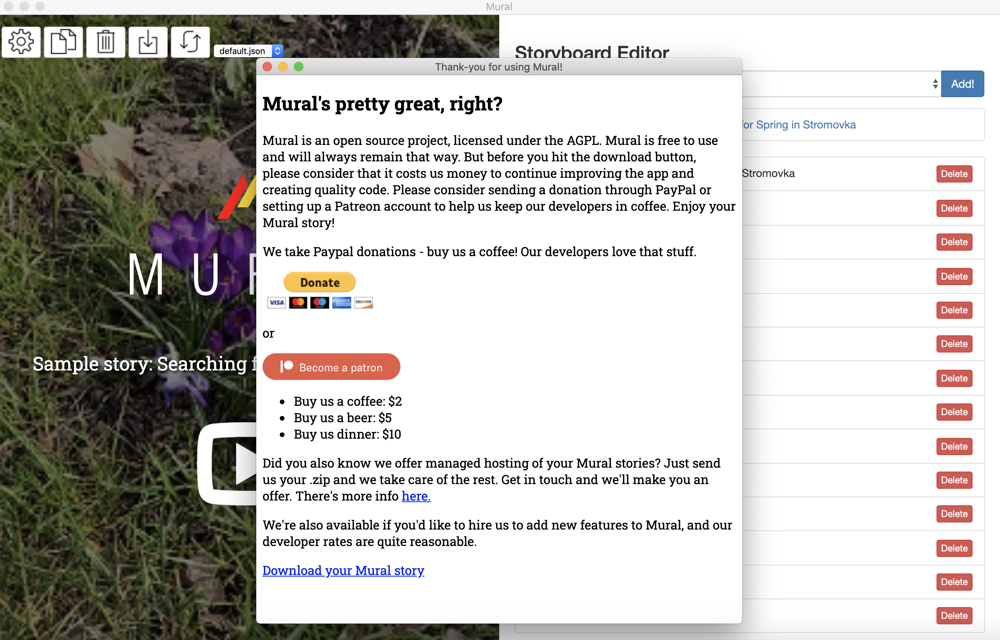

Mural is a desktop app created with <a href="https://www.electronjs.org" target="_blank" rel="noopener noreferrer">Electron</a>. You are able to use the Mural editor completely offline to create rich scrollytelling stories with a simple to use form based interface and your curated multimedia content. If some of your media assets are hosted online in places such as Vimeo or YouTube that is also totally fine as Mural will be able to handle remote images or videos as well - provided you have an internet connection.

The Mural editor has a two pane layout with your current story preview on the left and your storyboard on the right. The storyboard allows you to add different types of Mural items such as "Background Video" to your current story by using the dropdown at the top of the screen. Beneath the dropdown, the storyboard then displays a section for your story metadata and an ordered list of all your currently added Mural items to the story. This area will let you reorder your Mural items as well as click into them so you can edit the details for each specific item.

Once you've clicked into a Mural item to edit it - the simple to use form based editor pane will be shown for that item below your current list of Mural items. Here you insert everything you need to display one particular Mural item, which can be videos, images, audio, or text.

When you are finished creating your story and want to see the full results you can export your story from the editor. This creates for you a zip file of all your html, css, javascript, and media organised in a folder so that you can easily place this folder onto a webserver to share your creation online. Because everything you need to host your own story is exported for you - you have full control! If you do know some things about css and html, you are free to explore ways of customising the output to match your vision.
