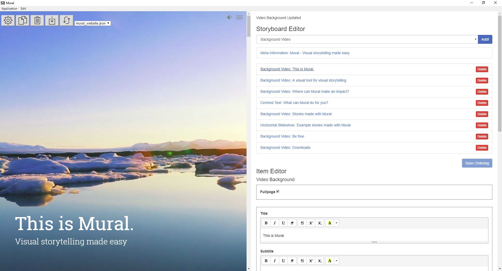

Mural is a tool for creating visual longform stories. The [Mural software is marking its official launch this week](https://www.getmural.io/), and it’s been a pleasure to work on it as with the support of the Google Digital News Initiative’s Prototype Fund. As our project is open source (AGPL), we figured that it would be good to extend our transparency and share with you some of the things we’ve learned along the way.

<!--truncate-->

A lot of this is technical, but as Father John Culkin once wrote about Marshall McLuhan’s philosophy, “We shape our tools, and thereafter they shape us.” The decisions we made in making Mural, and what we’ve learned in the process, might provide helpful insights for others making and using storytelling tools, as well as for those interested in how Mural was created.

### Lesson 1: Get out of the CMS

Traditional content management systems (CMSes) are great at a lot of things — they do a lot and do so stably. But one of the areas of greatest disappointment we’ve had has always been the way they work with visual content — the furthest most CMSes will go is to create a slideshow or embed media such as a video.

It’s 2018. We have cars that drive themselves, but the best visuals we get on web pages are slideshows. Something is wrong here.

We made Mural as a specific tool for a specific purpose: To present visual content with maximum impact. How we decided to achieve this turned out to be a very interesting exercise.

Mural had its start as a visual theme for a CMS called Newscoop, but to get it to work, users had to go through a great deal of pain. The CMS backend had to be hacked to within an inch of its life. Learning how to set up the server environment was a deeply Linux-heavy affair, and then users had to first learn the ins-and-outs of first the CMS, then the peculiarities of the theme. Users wailed and gnashed their teeth, but in the end they put up with it because the theme looked good once everything was in place.

The experience led to our first decision: In order to make a tool that truly works with visual content, we had to get away from the mentality that everything an organization does must be in one single CMS.

There are quite a few good CMS themes for outputting big visuals — Snowball for Wordpress is an example — but the problem isn’t with the theme, it’s with the backend. The Wordpress admin interface isn’t really isn’t made for working with visual content, and rearranging content can be tedious. This may change with initiatives like Wordpress’ Gutenberg editor — and we certainly hope so.

This led us to think: If we got away from the CMS, we could better understand the workflow of visual longform projects, which tend to be one-off efforts, assembled once and never updated again.

There was another plus. We could make the longform stories into static files, which would help to simplify things greatly on the technical side. With our output as static files, we wouldn’t need a dynamic server, with all of the overhead that managing one entails. In fact, we could go serverless if we wanted to. With static pages, organizations can publish their stories just about anywhere, and for less money and trouble than a CMS.

To be clear, strong visuals don’t require static pages. But static pages definitely makes the process simpler for less-technical users, and because time is money, we’re saving both.

It turns out we aren’t alone in thinking like this. The Chicago Tribune explored static HTML pages with its [Tarbell](http://www.tarbell.io/) project (a seriously underrated project, IMHO). The New York Times tends to hand-code its special pages, and the LA Times has its [Django Bakery](https://docs.google.com/presentation/d/1IybYcc0eVL-Rchm7lEQNwrM-AHRfr_M8ewfGYYNjeu8/edit?pli=1#slide=id.p) to generate static pages for its projects. You should check out the LA Times’ presentation on the Django Bakery to see what I mean. And then there’s [Jekyll](https://jekyllrb.com/), which is a whole universe unto itself.

All of these projects pointing to a similar conclusion: When it comes to visuals, it’s easier to go outside the CMS than to get it to do what you want, especially when it has to do with anything outside existing templates.

### Lesson 2: Focus on sequence

We started to think about what a specialized tool would look like if it were built for the single purpose of making visual longforms. The task could be broken down to three components — assembling, sequencing and presenting, and we started to look for effective metaphors.

As it turns out, one of the metaphors that works relatively well is presentation software. There are [many faults to Powerpoint](https://www.bbc.com/news/technology-35038429), but one of the things it does very well is to help users lay out visual sequences. We liked the drag-and-drop metaphor they use for ordering screens, so that was our model. In our parlance, we call the workspace the Storyboard, and the individual components Items.
We also wanted a tool that would bring about a shift in how video is treated in web storytelling. Many have spoken of a pivot to video, and while that hype wave has crested, the need still remains for media organizations to come up with more compelling uses for video. We think that full-screen, user-driven, sequential video could provide storytellers with some new ways to tell those stories.
In this way, we have different Items for the type of content that’s being presented. There are currently two video items, three static image items, two slideshow items and one text item:

- Fullpage video
- Background video
- Image parallax
- Image audio
- Image background
- Vertical slideshow
- Horizontal slideshow
- Centred text

Each of these items can then be used to present content, and the sequence of items can be rearranged by dragging and dropping.
Lesson 3: Move to the desktop
When we started work on Mural, we originally intended it as server software. This would let us create a service for authoring content, and would let us use a centralized code base. But then we started thinking about the large amounts of files that would be used by such a service, and the storage and bandwidth implications of that, and we started to think otherwise. Also, there are still enough places in the world that don’t have cheap and plentiful wireless broadband for sending and working with video.

Luckily, there’s been tremendous progress on an open source project called [Electron](https://electronjs.org/), which lets developers create desktop apps using JavaScript, HTML and CSS, and the same code can be used on Mac, Windows and Linux. We considered having both desktop and server versions of Mural, but for now we’ve decided to concentrate on the desktop version, as it solves more of our users’ pain points:

- **Low barrier to entry** You don’t need to know how to code to build a rich media site easily. Simply start writing and adding your media and the app will do the rest.

- **It’s faster** to work with a desktop program, because the user doesn’t have to upload videos to a server before working with the story

- **It’s easier to make changes** on the desktop version, as there is no lag

- Because **Mural outputs HTML, CSS and Javascript**, technically-savvy users can make additional changes before uploading by working in your favorite coding environment. We’ve also discussed ways to support code insertion inside the Mural editor, so that a technically savvy user would be able to write (or copy) the code they need

- **You have a choice of servers, and all of them are affordable.** We’re using a mix of different servers for the stories we make with Mural, and all of them are quite affordable.

- **Real world preview.** This allows for believable previewing of your work because what you see is being rendered in an actual browser in real time as you work.

- **Keep agile.** The user can work on the go to build a story with their assets as they create them. No need to wait for phone signal and internet tethering to continue working.

- The backend design we’ve chosen also lets us make a **mobile app later on.** We’d love to do this right away, but were faced with a very limited budget

### Lesson 4: Simple things done well

We understand very well that working with video, especially optimizing video, can take a long time. We had a lot of debates about whether or not to include video conversion functionality in the editor, but decided against this because it would add a lot of complexity to the code. Instead we decided to highlight in our manual a number of different external tools that are already very good at converting video. We would, however, like to make it clearer to the user that they have to optimize their videos themselves, and will improve this in future versions. That said, working with video is definitely an area we’re looking to improve.
We do plan on adding support to Mural for integrating YouTube and Vimeo videos in a future release, and are interested in embed support for a number of different services — support for data visualization tools like D3 are also on our to-do list. In fact, one of the artists we worked with in testing Mural, Dominic Smith, has created a piece, [The Volunteers](https://stories.getmural.io/isisarts/thevolunteers/), in which all of the videos are served from Vimeo.

### Lesson 5: Listening to and watching our users

One of the reasons we made Mural was so that journalists and people working in the arts would have the ability to better convey arts stories, which by their very nature are multimedia. Some of our earliest testers are artists themselves, and they’ve used Mural both as a way to document their work and as an artistic medium in and of itself.

We’ve listened to our users very carefully and have also watched them use Mural, and this has given us much clearer prioritization of our bugs and feature requests. We’re big practitioners of Design Thinking, and we started the project with personae representing types of users, but over time these personae have been replaced with real users and their very real tasks, needs and pain points.
Design Thinking also helped us to clarify and refine Mural’s features and functionality, and we continue to follow its five primary steps: Empathize, Define, Ideate, Prototype and Test.

### Lesson 6: Trust the community

One of our current discussions has to do with how to make Mural into a viable project that serves its community but also becomes a sustainable business. All of us on the Mural team are strong advocates of open source, and we’re taking a leap of faith in starting a new business while keeping that commitment. We believe that once we get Mural our into users’ hands, they’ll start to get involved in improving it and developing it further, as well as using the services we offer based on the tool.

We plan to offer a number of paid services on top of Mural, including hosting, optimization, and development of new features. We also want to offer consulting and training to show users how to make the most of not only Mural, but also a number of related apps and services. It’s cheesy to end this up this way, but it needs to be said: [Get in touch](mailto:getinfo@getmural.io) and we can work together to make it easier to tell visual stories!
