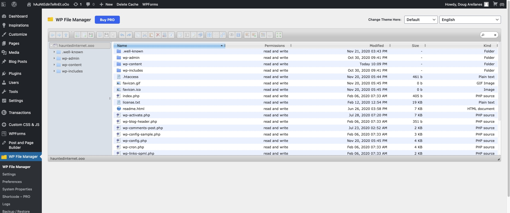
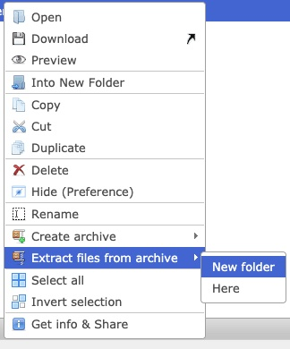
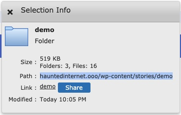
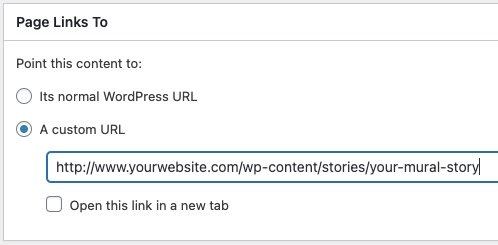
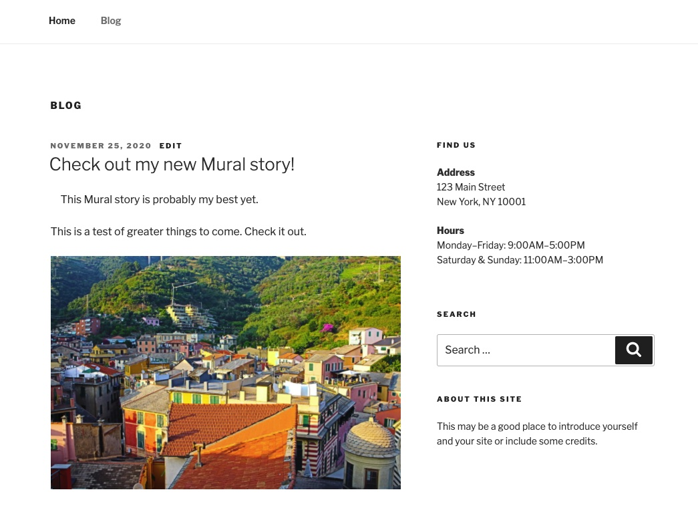

A question we get asked about on a fairly regular basis is "how on earth do I make Mural play nicely with Wordpress?"

After some experimentation we have found a simple two-step workflow to allow you to begin to bring Mural into your site.

<!--truncate-->

Our test site was hosted at <a href="https://www.dreamhost.com/" target="_blank" rel="noopener nofollow noreferrer">Dreamhost</a> as that is a fairly good example of what one might experience as an end user. We did not change anything from a default Wordpress installation. All the steps provided here should be within reach of a non-technical Wordpress website owner. You will need to be logged in as an admin in order to make these changes.

Let's look at what the actual requirements are. The first requirement is a method of uploading the necessary Mural files to the server and the second is a way of integrating those files into the posts and pages of a site.

<a href="https://wordpress.org/plugins/wp-file-manager/" target="_blank" rel="noopener nofollow noreferrer">WP File Manager</a> is a free and fully featured file manager. You can install it directly into your Wordpress via the Plugins Manager which you can find via `Plugins > Add New` and searching for it in the search bar.

Once WP File Manager is installed, our suggestion is to create a `stories` folder in your `wp-content` folder to store all of your Mural stories in. You can drag an entire folder structure onto the File Manager interface but to begin with we would suggest using the upload button.

Upload a Mural .zip file into the `/stories` directory. You can extract the files by right-clicking on the .zip file and selecting `Extract files from archive -> New folder`. Give your new directory a name and it will extract all the files from inside the Mural .zip file into that directory.

Optionally, you can copy the directory's URL by right-clicking your directory and selecting the last item, `Get info & Share`, which opens up a window called Selection Info. There you can copy the path to your directory.

Your new story is now available directly at `www.yourwebsite.com/wp-content/stories/your-mural-story/`. Be sure to test that it works by opening that URL in your browser before moving on to the next step.

Now we have to install <a href="https://wordpress.org/plugins/page-links-to/" target="_blank" rel="noopener nofollow noreferrer">Page Links To</a> in exactly the same way that we installed WP File Manager, via the Plugins Manager, which you can find via `Plugins > Add New` and searching for it in the search bar.

Once `Page Links To` is installed, you'll want to advertise your new Mural story to your audience.  The way to doing that is to create a normal blog post by going to `Blog Posts -> Add New`. Add a featured image that you'd like to represent your new content in your site's post or blog list. Don't forget to write a short introductory text to your new content which will also display.

Finally paste the link you saved above into the `Page Links to` field in your post editor. Mural stories use a custom URL, so select `A custom URL` and then paste the URL in the field.  The `Page Links To` plugin replaces the usual Wordpress blog post with the URL you specified, but keeps all the other fields for things like the front page.

Publish your post. Now when you visit your site you should see your new post title, image, and description as per normal on pages like the front page, but when you click on the entry will be taken to your Mural story. `Page Links To` also handles your blog post forwarding so you don't need to worry about anybody accidentally ending up at your placeholder post.

Finally don't forget to turn on the auto update for your new plugins to ensure your site's security.

It really is as easy as that.
