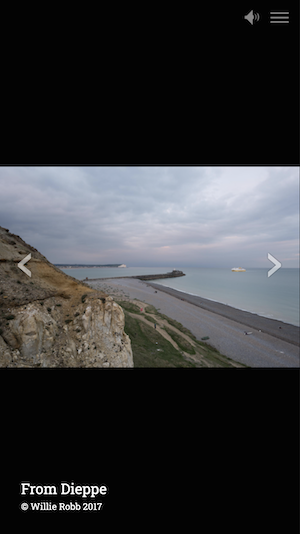
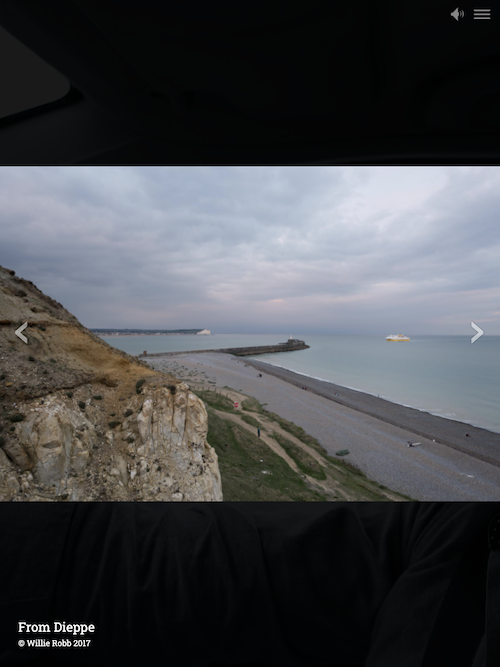

A Horizontal slideshow item refers to a collection of images that can be displayed in a slideshow with controls on the left and right, and where the images advance horizontally when a user clicks on the control.

`Slide [+]` Clicking this adds another slide to the slideshow. You can have as many slides in the slideshow as you want. For optimal results large slideshows are discouraged as currently all images for a slideshow are bulk loaded as a set.

## Title

This is for the title of the individual slide

## Credits

This is for the image credit

## Image Sources

### Small image

This image is for display on mobile. The small image works best at 1080 x 1920. (mobile portrait)

### Medium image

This image will be for display on older computers with lower-resolution screens or tablets. The medium image works best at 768 x 1024. (tablet portrait)

### Large image

This image will be for display on large and high-resolution screens. The large image works best at 1920 x 1080. (desktop landscape)

The width in pixels of each breakpoint of a Mural story window are:

- 768px
- 992px
- 1200px
