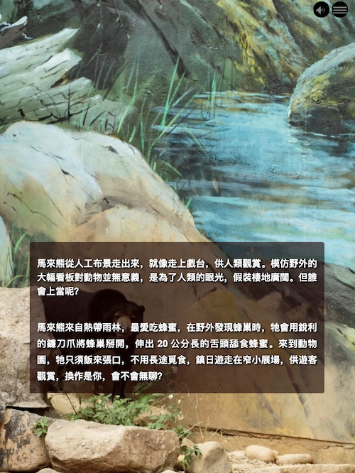

An Image Background item has a still image that takes up the entire screen, but which has title, subtitle, and body text over it as well as the possibility for looping audio. An Image Background item's image remains unmoving when a user scrolls until all of the text has scrolled. Then the story advances to the next item.

## Fullpage

This checkbox determines whether the final Mural story output will be more focused upon the image or the text. If the element is checked then your text will be forced towards the bottom of the Mural story window to allow more space for the image.

## Navigation Title

This is what the name of this view output will be called in the Mural story navigation menu. This does not have to be the same as the title.
Navigation is not a mandatory field and it can be left blank (not recommended) but it can also be supressed from the navigation (recommended if the field is blank).

## Title

This is what you would like the title of the Mural story output of this editor pane to display.

## Subtitle

This is the subtitle that displays under the main Mural story output of this editor pane.

## Text

This is the main text of the Mural story output of this editor pane. It is in rich text and can be formatted to include links, bold, italicised, and other text modifications.

## Offset Portrait Image

If your background image source is very wide and you are unhappy with the default central positioning of it when viewed in portrait mode then you can move it using the Offset Portait Image fields. The options available to you are `Left` - position the image to the extreme left of the Mural window, `Center` - position the image to the center of the Mural window which is also the same as the default positioning, `Right` - position the image to the extreme right of the Mural window, `Custom Offset` - here you can use the slider to change the offset value to anywhere between extreme left and extreme right and the value will be shown to you in terms of percentage.

## Image Sources

### Small image

This image is for display on mobile. The small image works best at 1080 x 1920. (mobile portrait)

### Medium image

This image will be for display on older computers with lower-resolution screens or tablets. The medium image works best at 768 x 1024. (tablet portrait)

### Large image

This image will be for display on large and high-resolution screens. The large image works best at 1920 x 1080. (desktop landscape)

The width in pixels of each breakpoint of a Mural story window are:

- 768px
- 992px
- 1200px

## Audio Sources

Both audio formats have a preview window available. At least one format is required - these days all modern browsers play mp3 so ogg is not strictly necessary. The audio file will loop infinitely.

### MP3

This is where you select the sound file you want that is in the MP3 format.

### Ogg

This is where you select the sound file you want that is in the Ogg format.
